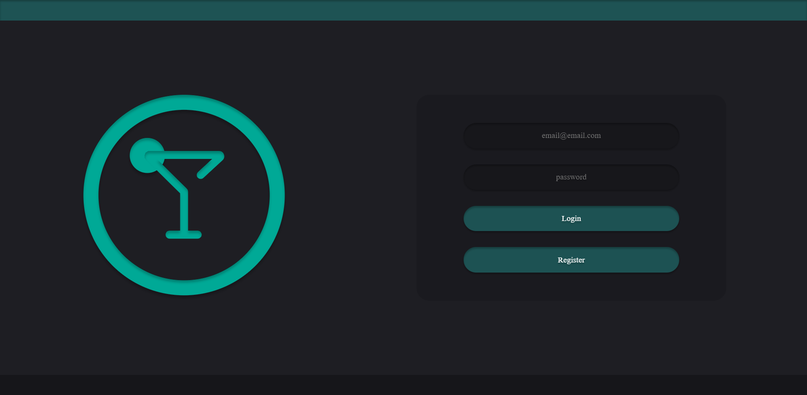
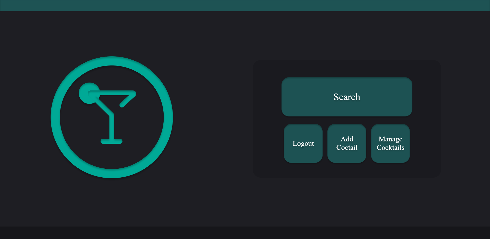
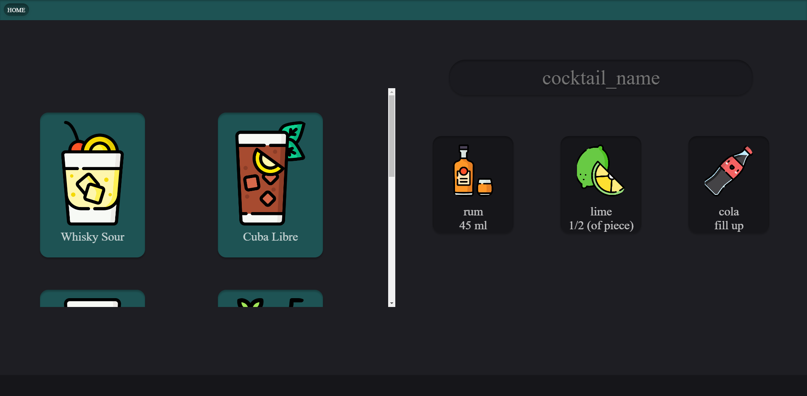
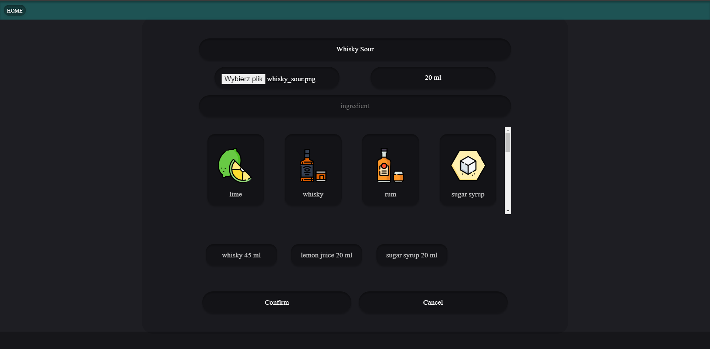
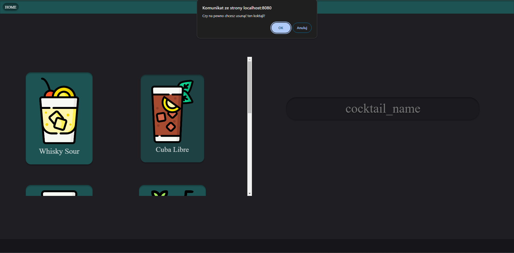

## Welcome to the Cocktail Website!
This project is all about making cocktails fun and easy for everyone.  
You can explore different drinks, see what goes into them, and even share your own recipes.  
It's a place to have fun with mixing drinks.  
Cheers to a world of mixology at your fingertips!

This module requires the following modules:
- 
1. [php](https://www.php.net/)  
2. [nginx](https://www.nginx.com/)  
3. [db (PostgreSQL)](https://www.postgresql.org.pl/)
4. [Docker Desktop](https://www.docker.com/products/docker-desktop/)

## Configuration

1. Open Docker Desktop.
2. Open the project folder.
3. Open terminal in your project.
4. Type `docker-compose up`.
5. In a browser search `localhost:8080`

## Preview
LOGIN PAGE

MAIN PAGE

SEARCH PAGE

ADD COCKTAIL PAGE

MANAGE COCKTAILS PAGE
